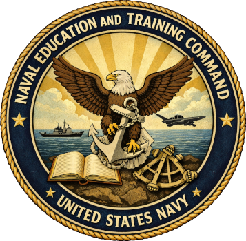

# Naval Education and Training Command 

A proposal for a roleplay-first training framework for Seventh Fleet. The basics are described below. Active development will begin soon. Evolution depends on leadership guidance, member feedback, and operational needs.

The basic concept is  that "book learning" stays off-world (web-based, short, self-paced). That way, in-world sessions stay fun, short, and scenario-driven.

A full version of the proposal can be found [here](https://7flt.davefl67.dev).

